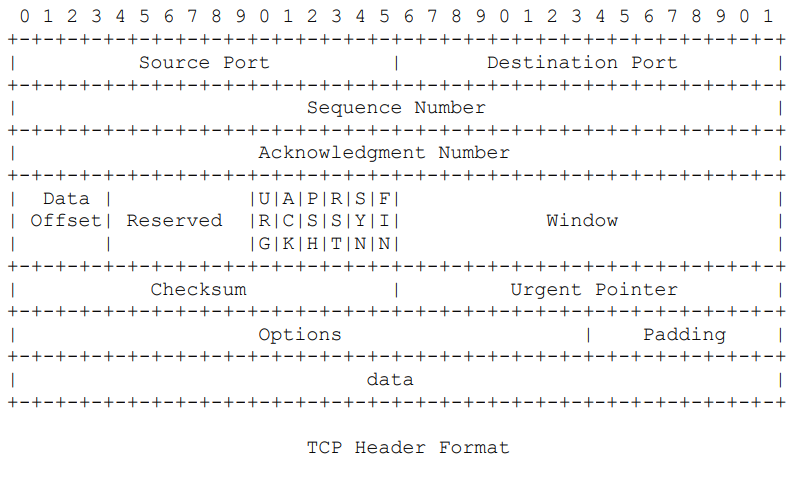

# 1. Rappel sur les bases de représentation
- **Quelles sont les bases des représentation binaire, décimale, hexadécimale ?**   

- **Pourquoi ces différentes bases de représentation existent ?**  
    binaire == base 2  
    décimal == base 10  
    hexadecimal == base 16

- **Donner la plage des valeurs accessibles pour un digit de chacune des bases.**  
    binaire == 1 
    décimal == 9  
    hexadecimal == 16
    
- **Connaissez vous d'autres bases de représentation des nombres ?**  
    

# 2. Manipulation des bases de représentation
**1.	Conversion décimal / binaire**
- **Rappeler le poids des différents bits d'un octet, ainsi que la façon dont ils sont calculés.**  
    
- **Convertir en décimal les adresses ip suivantes :**
    11011010.11010100.00011001.00001011 --> 218.212.25.11
    11101111.00010000.01010001.11110000 --> 239.16.81.240
    00001010.00000110.00000000.00000001 --> 10.6.0.1
- **En utilisant les 2 méthodes effectuez la conversion en binaire de l'adresse IP suivante :**  
72.213.8.1 --> 1001000.11010101.00001000.00000001 
- **Y a-t-il une méthode plus adaptée pour convertir les adresses suivantes :**  
128.16.64.2 -->  
132.255.8.43 -->  
- **En utilisant la méthode de votre choix déterminer la classe d'appartenance des adresses suivantes :**  
194.38.123.4 --> class C  
10.213.8.1 --> class A  
73.54.1.1 --> class A  
1.1.1.1 --> class A  
192.168.1.0 --> class C  
- **Et il nécessaire de convertir toute l'adresse ?**  
non il suffit juste de traduire le premier octet

**2.	Conversion décimal / hexadécimal**
- **Combien de digits hexadécimaux contient un octet ?**  
2 digit hexadecimal == 1 octet
- **Quelle est la valeur maximale en hexadécimal qu'un octet peut prendre ?**
FF == 255 == 11111111  
- **Quelle est la valeur minimale en hexadécimal d'un octet ?**  
00 == 0 == 00000000
- **En s'inspirant des questions du paragraphe 2.1 donner les différentes méthodes permettant de convertir un nombre décimal en hexadécimal.**  

- **Convertir les adresses suivantes en hexadécimal.**  
192.168.1.1 --> C0.A8.1.1  
10.213.8.132 --> A.D5.8.84  
127.0.0.1 --> 7F.0.0.1  
74.6.13.12 --> 4A.06.0D.0C
- **Donner le poids des 4 premiers digits d'un nombre hexadécimal.**  
- **Effectuer la conversion des adresses suivantes en décimal**  
FF.FF.FF.FF --> 255.255.255.255  
0A.D6.0E.01 --> 10.214.14.1  
C0.A8.01.01 --> 192.168.1.1  
AF.C2.1B.C4 --> 175.194.27.196

**3.	Conversion binaire / hexadécimal**
- **Convertir les adresse suivantes en hexadécimal**  
11011010.11010100.00011001.00001011 --> 218.212.25.11  
11101111.00010000.01010001.11110000 --> 239.16.81.240  
00001010.00000110.00000000.00000001 --> 10.6.0.1   
01011011.00101101.00110010.11111010 --> 91.45.50.250  
- **Convertir les adresses suivantes en binaire :**  
FF.FF.FF.FF --> 11111111.11111111.11111111.11111111  
0A.D6.0E.01 --> 00001010.11010110.00001110.00000001
C0.A8.01.01 --> 11000000.10101000.00000001.00000001  
AF.C2.1B.C4 --> 10101111.11000010.00011011.11000100  
16.64.51.33 --> 00010110.01100100.01010001.00110011   
- **A partir de la capture zone encadrée et en vous aidant du format de l'en tête TCP fournit en annexe donnez la valeur des drapeaux URG, ACK, PSH, RST, SYN et FIN**  

| ACK (Acknowledgment) | FIN (Finish) | RST (Reset) | PSH (Push) | URG (Urgent) | SYN (Synchronize) | 
|-|-|-|-|-|-|

| Source Port | Destination Port | Sequence Number | Acknowledgement Number | reserved | URG | ACK | PSH | RST | SYN | FIN |
|:-:|:-:|:-:|:-:|:-:|:-:|:-:|:-:|:-:|:-:|:-:|
| C3 B3 | 01 BB | 9A E0 46 FA | F1 5F B0 08 | 50 | 0 | 1 | 0 | 0 | 0 | 0 |