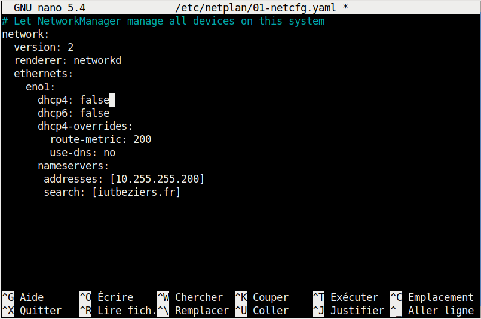
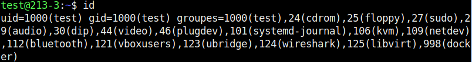
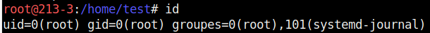
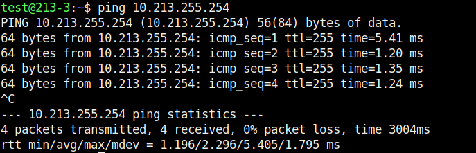
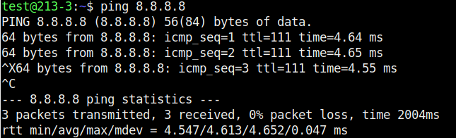
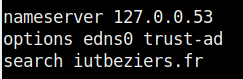
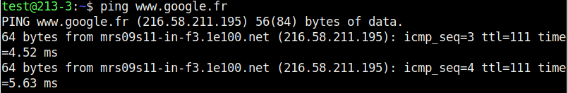

# R101 TP2 
Prise en main des outils informatiques  
Tom Wilhem RT1

---

4. **Premières commandes sous Linux**
    - **4.1 Login sous linux** 
      - Est-ce que les 2 sessions coexistent, ou bien l'ouverture d'une 2ème session ferme-t-elle la première ?
         - Lors du passage d'un session graphique a une session console, aucune des sessions ne ce ferme. elle coexiste sur le même PC. L'inverse est également vrai
    -  **4.2 Connexion à Internet**
       -  Pouvez-vous vous connecter à Internet ?
          - je suis a même de me connecter a internet car j'ai accès a des sites web sur internet
       -  Essayer de représenter, à l'aide d'un schéma, le chemin qui permet à votre machine d'être
reliée au réseau de l'IUT. Vous indiquerez tous les équipements ou prises par lesquelles vous
passerez avec leur numérotation sur la table, sur le panneau de brassage, etc
            ```mermaid
            flowchart LR
               A[PC] -->|câble RJ45 Port 6A| B(Switch)
               B -->|Câblage| C{Routeur}
               C -->|Câblage| D[DNS]
               C -->|Câblage| E[Sortie internet]
               C -->|Câblage| F[DHCP]
            ```

       - On desactive le DHCP avec ces actions
          -  ```Sudo nano /etc/netplan/01-netcfg.yaml```
          -  on change la valeur de Dhcp4 a false
          -  ```sudo netplan apply```
          -  
  
       1. **(Exercice 1)** Dans une console taper la commande id (elle permet d'identifier l'utilisateur courant).Quel est le nom de l'utilisateur connecté ?
          - comme on peut le voir sur la capture d'ecran, le id de la session est "uid=1000(test)". Cette id prouve que nous somme sur la session test
          - 
       2. **(Exercice 2)** Essayer de désactiver la carte réseau eno1 à l'aide de la commande : ```ip link set down dev eno1```
       3. **(Exercice 4)** Quel message est retourné ? Qu’est ce que cela signifie ?
          - Après utilisation de la commande dans mon terminal test, je reçois la reponse:  
         ```RTNETLINK answers: Operation not permitted```
       4. **(Exercice 5)** Taper à nouveau la commande id. Quel est le nom de l'utilisateur connecté ?
          - La commande ```id``` renvoie la reponse "uid=0(root)". cette reponse montre que la commande a été utiliser par l'administrateur root
          - 
       5. **(Exercice 7)** Recommencer la manipulation de désactivation de la carte eno1 en précédant la commande de sudo. Que peut on constater ?
          - Les commandes s'active bien si elles sont précédées de ```Sudo```
       6. **(Exercice 8)** Taper la commande id quel est l’identifiant de l’utilisateur ?
          - comme on peut le voir dans la console, le "uid=0(root)" indique que c'est l'administrateur root qui a activer la commande
       7. **(Exercice 9-10-11)** On utilise ces commandes pour "up" la carte reseau et lui mettre une adresse ip: 
          - ```ip link set up dev eno1```
          - ```ip addr add 10.213.3.1/16 dev eno1```
          - ensuite on utilise la commande pour assurer que l'on est bien connecter a la passerelle ```ping 10.213.255.254```
          - 
       8. **(Exercice 12)** Essayer de joindre la machine 8.8.8.8 à l'aide d'un ping. Que se passe-t-il ?
          - Lors de l'execution de la commande ```ping 8.8.8.8```, on reçoit le resultat:  
            "ping: connect: Le réseau n'est pas accessible"
            ce resultat indique que l'on a aucun accès au réseau public
       9. **(Exercice 13)** On rajoute une route grâce a la commande:
          - ```Sudo ip route add default via 10.213.255.254 dev eno1``` 
       10. **(Exercice 14)** Vérifier que vous avez maintenant accès à la machine 8.8.8.8 !
           - On utilise la commande ```ping 8.8.8.8``` afin de voir si on a accès au reseau public. Comme on peut le voir sur l'image, il dit bien que 3 packet sont passés validant donc l'installation
           - 
       11. **(Exercice 15-16)** Utiliser un éditeur (nano ou geany) pour éditer le fichier /etc/resolv.conf. Mettre un symbole # devant chaque ligne. Essayer dans un terminal la commande suivante :
ping www.google.fr
           - On utilise la commande ```Sudo nano /etc/resolv.conf``` afin d'acceder au fichier resolv.conf qui sert de fichier instruction au DNS
           - Dans le fichier resolv.conf on va mettre un "#" devant les trois lignes que nous voyons sur l'image
           - 
           - Après avoir mis en "commentaire" ces lignes et validé les changements. On execute la commande ```ping www.google.fr```. Elle nous retourne le resultat:  
            "ping: www.google.fr: Nom ou service inconnu"  
            Cette reponse indique que le DNS ne fait plus la liaison entre nom de domaine et adresse ip
       1.  **(Exercice 17)** Retirer les # dans le fichier resolv.conf et retenter l'expérience précédente. Quelle différence
constatez vous ?
           - Après avoir retirer les commentaires precedemment mis, le DNS recommence a fonctionner parfaitement, comme on peut le voir avec la commande ping ```ping www.google.fr```
           - 