# R101 TP3 
Manipulation des adresses IP  
Tom Wilhem RT1

---

1. **Configuration d'un poste de travail**
     - Quel est l'utilité de la commande mii-tool ?
        - En utilisant la commande ```man mii-tool```, une documentation s'affiche dans la console, on nous apprend que ```mii-tool``` "permet de vérifier l'état de la connexion, de forcer la vitesse et le mode duplex, et d'activer ou désactiver l'auto-négociation"
     - Dans le terminal taper la commande mii-tool. Expliquer le message d'erreur.
        - Si on tape la commande ```mii-tool <interface>``` en tant que user, on reçoit l'erreur:  
        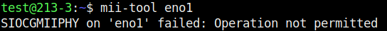  
        - On passe en root et execute la même commande, on obtient:  
        
        - Toujours en root, on execute la commande mii-tool -w eno1:
        ce resultat montre que le cable Rj45 a été debanché (plus de connexion avec le switch)
        
2. **Activer son interface**
     - Tapez la commande suivante et expliquer les termes associés à l'interface eno1 :
        - Après avoir executer la commande ```ip link show eno1```, on peut voir que l'interface est en "state up" en "default up". Cela nous indique que la carte est active
        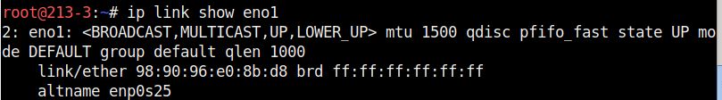
        - On "Down" l'interface reseau eno1 avec la commande ```ip link set down dev eno1```. Comme on peut le voir a la capture d'ecran, l'interface eno1 a été passé en etat "down".
        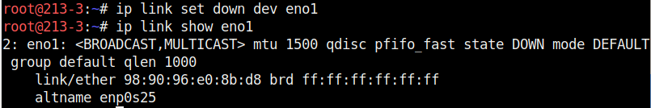 
        - En accedant a une page web, il me dit que je n'ai plus de reseau
        - On reactive la carte avec la commande ```ip link set up dev eno1```
        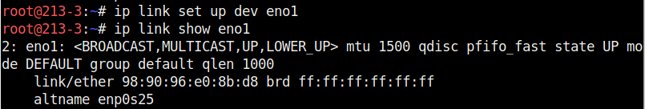 
3. **Configurer son interface**
    - Quelle option de la commande ip peut on utiliser pour visualiser l'adresse ip de sa machine ?
      - On peut utiliser la commande ```ip -c -br a``` afin de voir l'adresse ip de chaque interface
    - Taper la commande suivant et commenter le résultat :
      - La commande ```ip addr show eno1``` nous renvoie la commande le resultat de cette capture. On peut y voir l'adresse ip avec son masque attribuer a l'interface eno1
    - Quelle différence y a-t-il avec les commandes suivantes :
      - Les commandes ```ip addr``` ou ```ip a``` permettent de voir toutes les interfaces ce qui n'est pas très pratique
    - A votre avis, pourquoi peut on taper ip a en lieu et place de ip addr ?
      - En utilisant la commande ```man ip``` on decouvre que "a" est un argument pour all
    - Quelle option de la commande ip permet de supprimer toutes les adresses ip associées à une interface ?
      - La commande afin de supprimer les adresses ip d'une carte réseau est ```ip addr flush dev eno1```
    - Afficher maintenant la configuration ip de l'interface \<Nom De Votre Interface>. Que peut on observer ? 
      - En utilisant la commande ```ip -c -br a```, on peut voir que la carte eno1 est Up donc active mais quelle ne possede pas d'adresse ip
      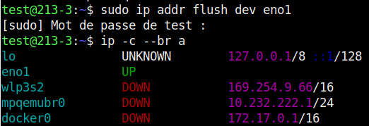 
    - A l'aide de la commande ip route afficher la liste des routes de sortie connues par votre machine. Que constatez vous ?
      - On peut voir que l'interface eno1 ne posséde plus de route
      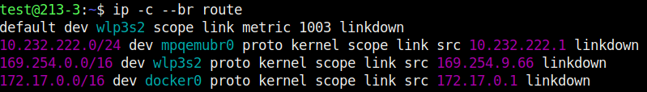  
    - Utilisez la commande ip addr add pour ajouter l'adresse correspondant à votre machine. Quels sont tous les champs qu'il faut utiliser dans la commande ?
      - On utilise la commande ```ip addr add 10.213.3.1/16 dev eno1``` afin de remettre une adresse ip a l'interface eno1
      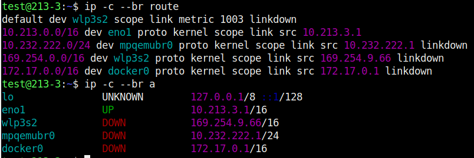  
    - Taper la commande suivante pour vérifier que votre machine et votre voisin arriviez bien à communiquer. A quoi correspond l’option -c 3 ?
      - J'execute la commande ```ping 10.213.2.1 -c 3```. Le retour m'informe que je detecte bien le pc de mon camarade et que je peux lui envoyer des paquets. Le -c 3 indique qu'il va envoyer trois ping avant d'arreter l'action. on peut voir que les paquets font une taille de 64 bytes, qu'il sont envoyé a l'adresse 10.213.2.1 en icmp, le temps de reponse est de 0.444ms au maximum. On a aucune perte de paquets indiquant une bonne connexion
      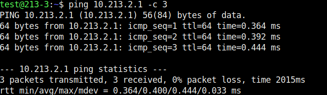  
    - Vérifiez que vous avez bien accès au réseau local en envoyant un ping sur une adresse interne (par exemple le serveur DNS: 10.255.255.200) mais aussi à l'internet en envoyant un ping sur 8.8.8.8
      - Après avoir mis la route. On ping le serveur DNS a l'adresse 10.255.255.200. On peut voir qu'il y a accès. On fait de même avec l'adresse DNS de google (adresse public) 8.8.8.8 et on peut voir qu'il y a accès. je peux en conclure que mon PC est connecter au reseau public
      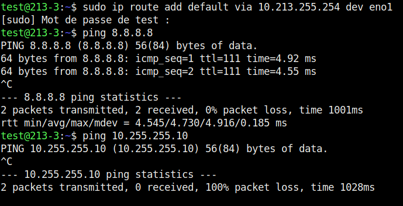  
4. **Tests sur la compatibilité des adresses**
5. **Masque de sous réseau**
    - Question 1/2/3
      - On va executer ces commandes afin de changer son masque en /24:  
      ```ip addr flush eno1```   
      ```ip addr add 10.213.3.1/24```  
      ```ip -c -br -a```
      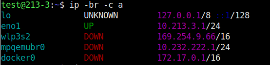 
      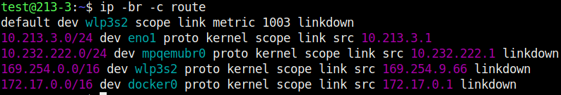 
    - Question 4/5 
      - En executant un ping sur ma machine vers mon binome ou l'inverse, le ping renvoie "Destination Host Uncreachable". Cette erreur indique que les deux pc ne sont pas en mesure de communiqué sur le réseau
    - Question 6 
      - Le masque de réseau qui ce met automatiqument est le /32 car l'adresse 10.213.3.1 est considéré comme une machine isolée du réseau si on ne lui ajoute pas de masque
      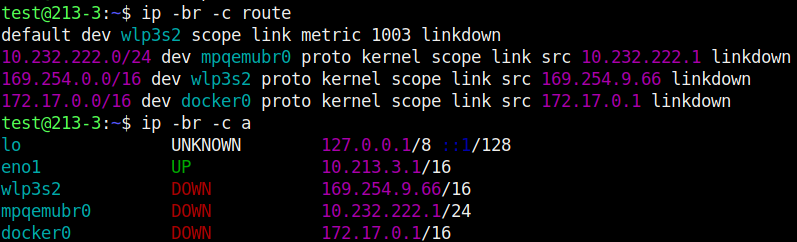 
    - Question 7
      - On ne peut pas joindre de machine du reseau local avec le masque en /32 car les machine ne sont pas considére comme sur le même réseau 
6. **Importance de l'adresse du réseau**
    - Question 1/2
      - On a execute la commande ```ip route flush dev eno1``` qui nous a permit de retirer la route de la carte réseau tout en gardant notre adresse ip
    - Question 4
      - On fait un ping sur la machine d'un binôme est je confirme que je ne peut pas le ping 
    - Question 4/5
      - Je vois que je suis en mesure de joindre le PC de mon binome et qu'il est egalement possible pour lui de me joindre. je ne suis pas en mesure de ping un autre PC du reseau local. j'en conclus que ma route en /32 ne me permet d'acceder que a l'adresse de route definit.
    - Question 6 
      - Cette solution est viable si il y a que 1 ou 2 machine mais si il y a 60 machines alors cela devient invivable car il faudrait configuré $60^{60}$ route  
    - Question 7
      - On execute la commande ```ip route dev eno1``` pour retirer ma configuration puis j'execute la commande ```ip route add 10.213.0.0/16```. Je teste ensuite la connexion avec un de mes camarades avec la commande ```ping 10.213.9.1```, je reçois bien les paquets
    - Question 8
      - En conlusion. L'adresse de reseau permet a ma machine de ce connecter et de communiquer sur un reseau, sans lui je suis incapable de joindre une quelconque machine

7. **Rôle de la passerelle**
    - Question 1 
      - On execute la commande ```ip addr flush dev eno1``` 
    - Question 2-3
      - Je met ma machine en 192.168.1.3/24 avec la commande ```ip addr add 192.168.1.3/24 dev eno1```. Mon college va lui mettre sa machine en ```10.213.4.1/8```
    - Question 4
      - J'execute la commande ```ping 10.213.4.1```. Le message d'erreur qui nous est renvoyé est: ```ping: connect: Le réseau n'est pas accessible```  
    - Question 5
      - On passe en mode root avec la commande ```su -```. Puis on execute la commande ```echo 1 > /proc/sys/net/ipv4/ip_forward```
      ```mermaid
      flowchart LR
        B(PC en 10.213.4.1/8)
        D(PC en 192.168.1.3/24)
        B -->|reseau en 10.0.0.0| C{Routeur}
        D -->|reseau en 192.168.1.0| C{Routeur}
      ``` 
    - Question 6-7
      - On rajoute la route avec la commande ```sudo ip route add default via 192.168.1.254 dev eno1``` en tant que test.
      - Mon collegue va lui executer la commande ```ip route add default via 10.255.255.254 dev eno1```
    - Question 8 
      - On test la connexion entre la machine du collegue avec la commande ```ping 10.213.4.1```. La connexion a bien reussi.
    - Question 9
      - En conclusion si deux machines de reseau different souhaite communiqué, alors il devront passé par un routeur qui fera la transmission entre les deux reseau  