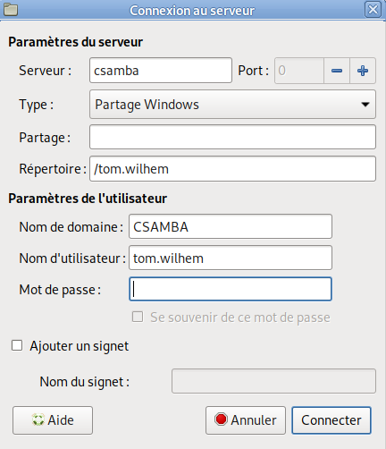

# R101 TP5 Gestion des dossiers

Tom Wilhem

---

11. **Linux**
   - On tape la commande ```sudo nano /etc/samba/smb.conf``` pour acceder au fichier de configuration de samba. Dans ce fichier smb, on rajoute ces lignes sous la balise [global]:  
     ```
     client min protocol = CORE  
     client max protocol = SMB3
     ```
     On va ensuite dans Emplacement --> connexion a un serveur --> puis on entre nos informations
    
    

12. **Partage de fichiers entre machine physique et machine virtuelle**
    - On connecte un dossier partager entre la VM windows et le PC Linux en allant sur la configuration de virtualBOX puis sur "dossier partagés" afin d'ajouter le lien du fichier de la machine physique a monté sur la machine virtuelle 
     

13. **Entre 2 poste Linux**
    - On installe le paquet SAMBA avec les commandes suivantes 
        ```
        apt update   
        apt install samba (partie serveur)  
        apt install samba-client (partie client)  
        cp /etc/samba/smb.conf /etc/samba/smb.conf.old
        ```  

    **Question : quelle est l'opération réalisée ?**  
        - On utilise la commande cp qui permet de copier coller le contenu du fichier "smb.conf" dans le fichier "smb.conf.old" afin de garder une trace de l'ancienne configuration avant de faire des changements 
    - On edite le fichier de configuration avec la commande  
        ```
        nano /etc/samba/smb.conf
        ```
    - On ajoute ces lignes dans le fichier smb.conf: 
        ```
        ######## Partage ########
        [toto]
            path = /home/nas
            public = no
            force group = nas
            valid users = @nas
            writeable = Yes
            create mask = 0770
            force create mode = 0770
            directory mask = 0770
        ```
    - **Question : indiquer les messages que vous récupérez et analysez les.**
        Les massages que l'on recoit après l'execution de la commande ```testparm /etc/samba/smb.conf``` sont ceux de la validation du process. En appuyant sur "entrée" il nous renvoie toutes les lignes du fichiers de configuration qui ce trouve sous les balises, il n'affiche pas non plus les commentaires
    - **Question : quelle commande permet de créer le répertoire déclaré dans le fichier de configuration /etc/samba/smb.conf ? Dans ce répertoire créez un fichier nommé transfert, éditez le et enregistrez quelque chose à l'intérieur.**
        On crée le fichier "NAS" avec les commandes: 
        ```
        mkdir /home/nas  
        nano /home/nas/transfert (on ecrit "fichier de transfert" dans le fichier)
        ``` 
    - On crée le groupe et on attribue les droit d'accès au samba avec les commandes: 
        ```
        adduser nas (on lui met le mot de passe "test")
        usermod -G nas,test test
        systemctl restart smbd
        smbpasswd -a test ("on met le mot de passe de test au fichier samba a "test")
        ``` 
    - **Question : quelle est la syntaxe de la commande à utiliser ? Quel est le résultat de la commande ?**
        On utilise la commande ```pdbedit -L``` afin de lister les utilisateurs du groupe "nas". Le resultat est sous la forme "nom:ID:description"
    - On modifie les droit du repertoire "nas" avec la commande ```chown -R nas:nas /home/nas```
    - **Question : quelle est l'action réalisée par cette commande ?**
        La commande ```chown -R nas:nas /home/nas``` change le proprietaire du repertoire "nas" et de tous les fichiers dans le repertoire "nas" au proprietaire "nas"
    - On modifie les droit du repertoire nas avec la commande ```chmod -R 0770 /home/nas```
    - **Question : quelle est l'action réalisée par cette commande ?**
        La commande ```chmod -R 0770 /home/nas``` change les droits du repertoire "nas" et de tous ce qu'il contients pour que le propriétaire et les membres du groupes est le droit de modification, lecture, execution.
    - On ce connecte a partir du client au serveur samba avec la commande ```smbclient \\\\@IP_DU_SERVEUR\\PARTAGE -U UTILISATEUR```  
    - **Question : précisez la syntaxe exacte que vous utilisez pour tester le partage entre votre client et votre serveur.**
        La commande que j'utilise est la commande ```smbclient \\\\10.213.0.86\toto -U test``` 
    - **Question : à l'aide de la commande « ? » regardez la liste des commandes accessible depuis l'environnement samba. Quelle commande vous permet de rapatrier le fichier transfert depuis le serveur sur le client ?**
        La commande pour rapatrier le fichier "transfert" est la commande ```get transfert``` 
14. **Entre le serveur sous linux et le client sous windows**
    - **Question : allez dans le poste de travail et observez le contenu du réseau. Trouvez vous votre serveur Linux Samba ?**
        Dans la partie reseau de mon windows, je rentre dans la barre de recherche la ligne ```\\10.213.0.110```.
    - **Question : Si oui cliquez dessus. Qu'est-ce qui vous est demandé ? Quels sont les valeurs que vous allez saisir ?**  
        Après avoir ajouter cette ligne, deux repertoire apparaisse, un nommé "NOBODY" et un "test". On clique sur le dossier "test" et on entre l'identifiant "test" et le mot de passe "test".
