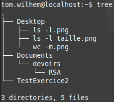

# TP1 : Système de fichiers

---

Tom Wilhem  
RT1  

---

## 1. Répertoire personnel de l’utilisateur :  
**1. Affichez la valeur du répertoire utilisateur.**  
Pour afficher la session utilisateur, on peut utiliser la commande ```echo $HOME``` dans un terminal de commande. Cette commmande devrait renvoyer le chemin de la session jusqu'a la racine. Dans mon cas elle renvoie ```/home/t/tom.wilhem```  

**2. Affichez la valeur du répertoire courant.**  
Pour afficher la valeur du repertoire courant, on peut utiliser la commande ```pwd``` dans un terminal de commande. Cette commande devrait renvoyer le chemin de l'endroit ou ce situe l'invite de commande depuis la racine. Dans mon cas, elle me renvoie ```/home/t/tom.wilhem```  

**3. Quel est donc le répertoire courant après ouverture d’une session ?**  
Le repertoire courant a l'ouverture de ma session est celui de ma session. Dans mon cas c'est ```/tom.wilhem```  

**4. Déplacez-vous vers la racine en une commande**  
Pour ce deplacer a la racine, on utilise la commande ```cd /```. Le '/' signifie la racine de l'aborescence de fichier.

**5. Faites afficher sous forme de liste les fichiers et dossiers présents en recherchant dans la documentation de ls.**  
Dans la documentation ls, on peut voir que ```ls -l``` donne beaucoup d'information. En l'executant, elle me renvoie les lignes sur cette capture d'ecran: 


## 2. Editeurs de textes :  
**1. Retournez dans votre dossier personnel en une seule commande.**  
Pour retourner dans son repertoire personnel, on peut utiliser la commande ```cd ~``` . Le tilde "~" represente la session utilisateur.  

**2. Tapez un mot dans le fichier puis sauvegarder les données.**  
Je crée un fichier nommé "TestExercice2" avec ma commande ```nano TestExercice2``` . Dans le fichier qui vient de s'ouvrir, je rentre la phrase "Je fais un test". Je quitte ensuite le fichier avec la combinaison ```crtl + x``` puis je clique sur ```o``` pour valider mon changements.  

**3. Vérifiez que la taille du fichier et comparez-la au nombre de caractères tapés.**  
Afin de connaitre la taille d'un fichier je peut soit utiliser la commande ```ls -l``` pour avoir un detail de tout les fichier plus ses droits ou alors je peut taper la commande ```wc -m TestExercice2``` . Dans les deux cas, on me renvoie une taille de 16. En regardant le fichier il n'y a que 12 caractere, mais il y a 3 espaces ce qui equivant a 15 KO. Cette difference est du au caractere de fin "EOF" qui dit que le fichier est terminé, ce caractere est invisible. 
- Voici la capture d'ecran de ```ls -l```  

- Voici la capture d'ecran de ```wc -m TestExercice2```  


**5. Faites afficher le contenu de votre fichier.**  
Pour afficher le contenu d'un fichier dans l'invite de commande, je tape la commande ```cat TestExercice2``` . Cette commande va afficher tout le texte du fichier "TestExercice2" dans 'linvite de commande. Dans mon cas la commande renvoie "Je fais un test"

## 3. Création d'une arborescence donnée :  
**1. Déplacez-vous dans votre répertoire utilisateur.**  
On ce deplace dans le repertoire utilisateur avec la commande ```cd ~```  

**2. Affichez le contenu du répertoire utilisateur.**  
Pour afficher le contenu du repertoire utilisateur ainsi que tout ses fichiers et repertoires, on utilise la commande ```tree``` . 
- voici son resultat :  


**3. Effacez en un minimum de commandes, tous les fichiers et répertoires existant dans le répertoire utilisateur (sauf votre compte-rendu !).**  
Pour supprimer tout les fichier dans ma session utilisateur, j'utilise la commande ```rm -rf ~```.  
la commande "rm" est le diminutif de "remove", le -r signifie "recursif", le f signifie "force", et le tilde "~" signifie "repertoire utilisateur"

**4. Vérifiez le résultat.**  
Afin de ne pas supprimer mon compte-rendu, je n'ai pas executer la commande. Mais pour voir son resultat on peut taper la commande ```ls -l``` qui devrait ne rien retourner.

**5. Créez l'arborescence suivante en utilisant des noms absolus et sans changer de répertoire courant. Attention, / et /tmp existent déjà.**  
On peut utiliser ces commandes pour crée cette arborescence : 
```mkdir -p /tmp/rt1/xyz/{Programmes/{java,php,"langage_C"},public_html/{docs,images}}```  
Cette commande permet de crée tout les repertoires de l'arborescence:  
  

```touch /tmp/rt1/xyz/public_html/index.html /tmp/rt1/xyz/java/TP.java /tmp/rt1/xyz/programmes/langage_C/a.c```
Cette commande permet de crée tout les fichier dans leur repertoire respectif:  


**6. Modifiez le contenu de index.html pour écrire le texte : ```<h1>Bonjour !!!</h1>```.**  
Afin d'ecrire dans le fichier, on execute la commande ```nano /tmp/rt1/xyz/public_html/index.html```  

**7. Vérifiez le contenu du ficher avec une commande.**  
On verifie le contenu du fichier avec la commande ```cat /tmp/rt1/xyz/public_html/index.html```. la commande nous renvoie bien ```<h1>Bonjour !!!</h1>```  

**8. Copiez le contenu du répertoire programmes dans le répertoire images.**  
Pour copier tout le contenu du repertoire "programmes". on utilise la commande ```cp -r /tmp/rt1/xyz/programmes/* /tmp/rt1/xyz/public_html/images/```. La commande "cp" permet de copier du premier repertoire vers le second repertoire, le -r veut signifie recursivement  


**9. Déplacez toute la partie programmes dans le répertoire docs.**  
Pour deplacer le repertoire "programmes" et tout ces fichiers, on utilise la commande ```mv -r /tmp/rt1/xyz/programmes /tmp/rt1/xyz/public_html/docs/```  
  

**10. Affichez le contenu détaillé du répertoire docs.**  
Pour afficher le contenu detaillé du repertoire docs, j'utilise la commande ```ls -lR /tmp/rt1/xyz/public_html/docs```. Il me renvoie ce resultat:   
