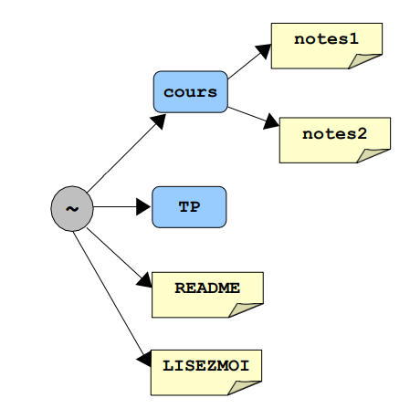
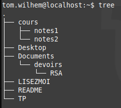
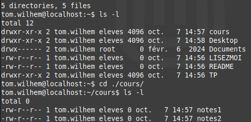

# TP2 : Commandes UNIX

Tom Wilhem  
RT1  

---

## Exercice 1 – Créations, suppressions et droits d'accès  

**1. A l’aide de commandes, créez l’arborescence donnée ci-dessous et déplacez-vous à l’intérieur.**  

afin de crée cette arborescence:
  
On va utiliser la commande ```mkdir ./{cours,TP}``` afin de crée les repertoires "TP" et "cours". Puis j'utilise la commande ```touch ./{README,LISEZMOI}``` afin de crée le fichier "README" et "LISERMOI". Puis j'utilise la commande ```cd ./cours``` afin de me deplacer dans le repertoire "cours", et j'execute la commande ```touch ./{notes1/notes2}``` afin de crée les fichiers "notes1" et "notes2"


**2. Par défaut, quels sont les droits d'accès des fichiers crées ? Et répertoires créés ?**  
Sur la capture d'ecran, les droits sont representés par des droits.
    - r = read = droit de Lecture
    - W = write = droit d'ecriture
    - x = Execute = droit d'execution
    - d = directory = repertoire
Comme on peut le voir sur la capture d'ecran, les repertoires sont en droit "RWX R-X R-X", Les trois première lettre indique que le propriétaire a le droit de lire, ecrire, executé. Les trois lettres suivantes indique que le groupe auquel il appartient a les droit de lecture et d'execution, de même pour les personnes lambda


**3. Rajouter le droit d'écriture pour tous au fichier notes1.**  
Afin de changé les droits du fichier notes1 pour rajouté le droit d'ecriture, on utilise la commande ```chmod a+w ~/cours/notes1```.

**4. Modifier les droits d'accès du fichier LISEZMOI pour qu'ils soient à 521. Vérifiez par une commande.**  
Pour changer les droits du fichier LISERMOI a 521, on utilise la commande ```chmod 521 ~/LISEZMOI```

**5. Supprimer ensuite tous les répertoires et fichiers créés.**  
Pour supprimer tous les fichiers et repertoire crée, on utilise la commande ```rm -rf ~/{cours,TP,README,LISEZMOI}```.


## Exercice 2 – Copies et déplacements de fichiers  

**1. Dans votre home directory, créer un répertoire essai.**  
On crée le repertoire avec la commande ```mkdir ~/essai```

**2. Copier les fichiers /etc/passwd et /etc/group dans le répertoire essai sous des noms différents.**  
On copie les fichiers avec la commande ```cp /etc/passwd ~/essai/shad```, ce fichier prendra le nom "shad". On fait de même pour le fichier group de manière a ce qu'il ce nomme "grp" ```cp /etc/group ~/essai/grp```.

**3. Créer dans essai un répertoire copies.**  
On crée le repertoire copie avec la commande ```mkdir ~/essai/copies```

**4. Déplacer un des fichiers de essai dans copies.**  
On deplace le fichier "shad" dans le repertoire "copies" avec la commande ```mv ~/essai/shad ~/essai/copies```

**5. Créer un répertoire titi dans copies.**  
On crée un repertoire dans "copies" avec la commande ```mkdir ~/essai/copies/titi```

**6. Supprimer le droit d'exécution 'x' pour le répertoire copies.**  
On supprime les droits d'executions du repertoire "copies" avec la commande ```chmod -x ~/essai/copies```

**7. Taper ls copies. Que remarquez-vous?**  
On tape la commande ```ls ~/essai/copies```. La commande nous affiche le documents et le repertoire qui sont presents dans le fichier "copies"


**8. Détruire le contenu du répertoire copies avec la commande rm. Que remarquez-vous?**  
On detruit le contenu du repertoire avec la commande ```rm -rf ./essai/copies/```, la reponse nous indique que nous n'en avons pas le droit, car nous n'avons pas les droits d'executions.


**9. Ajoutez le droit d'exécution 'x' pour le répertoire copies.**  
On ajoute le droit d'execution au repertoire copies avec la commande ```chmod +x ~/essai/copies```

**10.  Chercher à l’aide de man l’option de la commande rm permettant de détruire le répertoire copies.**  
Pour détruire le repertoire "copies", il faut deja supprimer son contenu. Pour faire cela nous allons utilisez l'option rf pour supprimer les fichiers en recusif et de force. Voici la commande ```rm -rf ./essai/copies```


## Exercice 3 – Visualisation de fichiers dans le terminal  

**1. Afficher le contenu du fichier /usr/include/dialog.h avec la commande cat.**  
On utilise la commande cat pour afficher le contenu du fichier "dialog.h" avec la commande ```cat /usr/include/dialog.h```

**2. Faire cat sans nom de fichier. Que remarquez-vous? Sortir avec CTR-D.**  
Quand j'execute la commande ```cat``` sans argument, il tourne en boucle sans me renvoyer de resultat.

**3. Faire cat /etc/group.**  
J'affiche le contenu du fichier "group" avec la commande ```cat /etc/group```

**4. Afficher le même fichier avec la commande more.**  
J'affiche le contenu du fichier "group" avec la commande ```more /etc/group```, On peut remarquer que la commande "cat" envoie l'entiereté du fichier alors que la commande "more" ne renvoie que une partie et attend que l'on clique sur entrée pour afficher la suite ligne par ligne

**5. Faire whatis ls. Que remarquez-vous? De même avec whereis et which.**  
On execute la commande ```whatis ls```, elle nous renvoie ce qu'est "ls".  
On execute la commande ```whereis ls```, elle nous renvoie le chemin des fichiers et repertoires nommé "ls".  
On execute la commande ```which ls```, elle nous renvoie a le chemin du fichier de commande "ls"  


## Exercice 4 – Liens symboliques  

**1. Créer un fichier de test nommé original et un lien physique sur ce fichier nommé physique. Ecrivez à l’aide de nano du texte (une 20e de caractères). dans le fichier original.**  
On execute la commande ```touch original``` pour crée un fichier nommé original. On execute la commande ```ln original physique``` pour crée un lien entre le fichier original et le nouveau fichier physique.
On execute ````nano ~/original``` et on met la phrase "une 20e de caracteres" puis on valide et ferme nano.

**2. Ouvrir les fichiers original et physique. Que constate-t-on après édition du fichier physique ?**  
On regarde contenu de physique avec la commande ```nano ~/physique```, on a bien tous les caractères que l'on a entrée dans le fichier "original" qui s'affiche dans le fichier "physique" . On modifie le fichier "physique" et en regardant le contenu du fichier "original" avec la commande ```cat ~/original```, les changements fait dans le fichier physique sont aussi appliqué au fichier "original"

**3. Créer un lien symbolique sur ce fichier nommé symbolique.**  
On crée un lien symbolique avec la commande ```ln -s ~/original ~/symbolique```

**4. Faites un ls -l. Que constatez-vous ?**  
La commande ```ls -l``` nous affiche le lien symbolique du fichier symbolique vers le fichier original


**5. Modifier le contenu du fichier original. Que constate-t-on au niveau du fichier symbolique ? Et au niveau du fichier physique ?**  
En modifiant le contenu du fichier "original", le contenu des fichiers symbolique et physique s'en trouve changé

**6. Effacer le fichier original puis ouvrir le fichier symbolique. Que se passe-t-il ?**  
On execute la commande ```rm ~/original``` dans le but de supprimé le fichier "original". On ouvre ensuite le fichier "symbolique" qui ce retrouve vide suite a la suppression du fichier "original"

**7. Ouvrez le fichier physique. Que se passe-t-il ? Concluez.**  
On regarde le contenu du fichier "physique" et on ce rend compte que le contenu du fichier est toujours present contrairement au fichier symbolique. On peut en conclure que le lien symbolique ouvre directement le fichier "original" tandis que le lien physique copie ses données sur le fichier "original"
   

## Exercice 5 – La commande ls  

**1. Listage simple.**  
Pour un listage des fichiers et repertoires presents dans un repertoire, on execute la commande ```ls```

**2. Listage incluant les fichiers cachés ou ceux qui commencent par ".". On remarquera la présence des 2 fichiers "." et ".."**  
Pour lister les fichiers et repertoires cachées, on utilise la commande ```ls -a```

**3. Listage avec descriptif complet de chaque référence : droits, nombres de liens, dates, taille user group, etc.**  
Pour lister les detailles de chaque fichier et repertoire, on utilise la commande ```ls -l```

**4. Créez des sous-répertoires ainsi que des fichiers dans ces répertoires et faites un listage récursif du contenu de tous ces sous-répertoires. Puis un listage récursif détaillé.**  
Pour lister les sous repertoies de manières recusif, alors on utilise la commande ```ls -R```. Pour un listage recusif detaillé, on utilise ```ls -lR```

**5. Listage par ordre chronologique, et inverse.**  
Pour lister les fichiers dans l'ordre chronologique, on utilise la commande ```ls -t``` puis dans le sens inverse on utilise ```ls -tr```

**6. Listage simple du contenu du répertoire, avec spécification du type de fichier : répertoire /, lien symbolique @, exécutable * .**  
Pour afficher les specifications du type de fichier, on utilise la commande ```ls -F```


## Exercice 6 – La commande grep  

**1. Liste des mots se terminant par les lettres « cot ».**  
La commande permettant de lister tous les mots finissant par "cot" est la commande ```grep "cot$" <\Chemin du repertoire>```

**2. Mots commençant par « ab » et se terminant par « t ».**  
La commande permettant de lister tous les mots commencent par "ab" et se terminant par "t" est ```grep "^ab.*t$" <\Chemin du repertoire>```

**3. Mots commençant par une lettre dans l’intervalle [\a-l].**  
La commande permettant de lister tous les mots commencent par une lettre entre "a" et "l" est ```grep "^[a-l]" <\Chemin du repertoire>```

**4. Compter le nombre de mots commençant par « V »**  
La commande permettant de compter tous les mots commencent par "V" est ```grep -c "^V" <\Chemin du repertoire>```