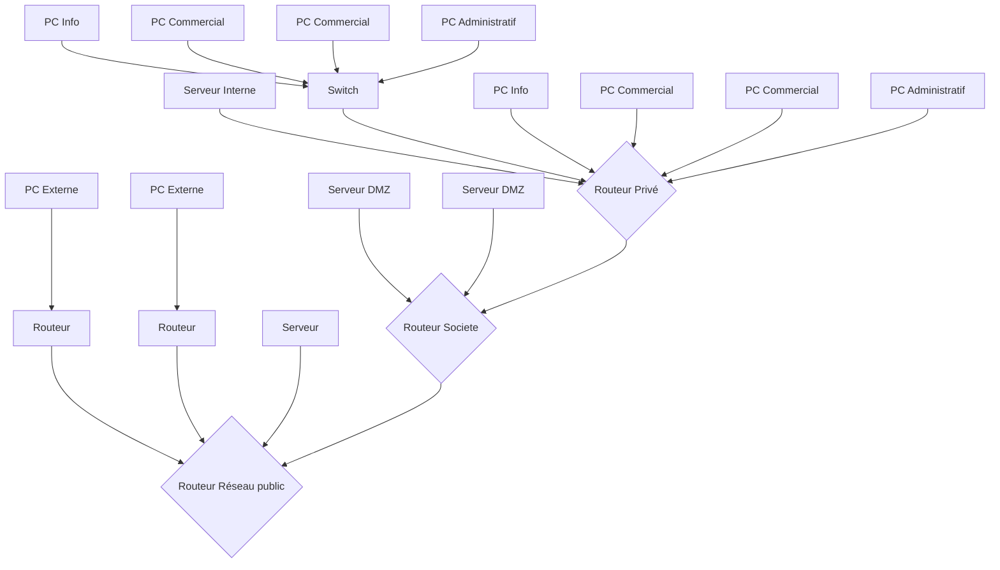

```mermaid
flowchart TD
    A{Routeur Réseau public}

    B[Routeur] --> A
    C[PC Externe] --> B

    D[Routeur] --> A
    E[PC Externe] --> D

    F[Serveur] --> A

    G{Routeur Societe} --> A
    H[Serveur DMZ] --> G
    I[Serveur DMZ] --> G
    K{Routeur Privé} --> G
    L[Serveur Interne] --> K
    M[Switch] --> K
    N[PC Info] --> M
    O[PC Commercial] --> M
    P[PC Commercial] --> M
    Q[PC Administratif] --> M
    R[PC Info] --> K
    S[PC Commercial] --> K
    T[PC Commercial] --> K
    U[PC Administratif] --> K


```